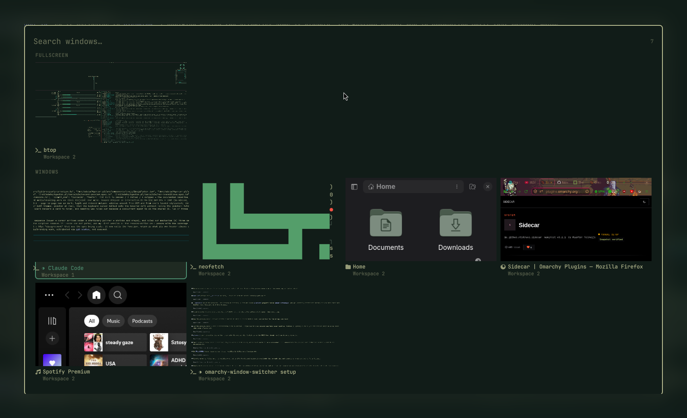
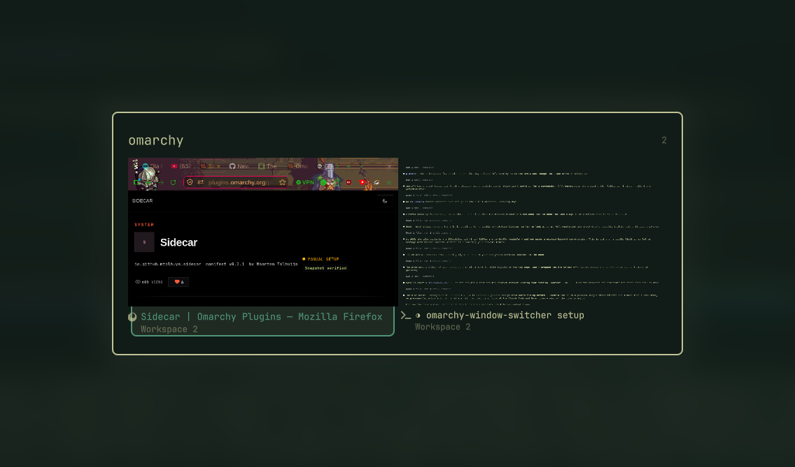

# Better Alt-Tab

**Alt-Tab that shows you your windows.** A searchable gallery of live window
previews for [Omarchy](https://omarchy.org/) / Hyprland, bound to `ALT + TAB`.



## Why

Omarchy binds `ALT + TAB` to "focus next window", which walks windows one at a
time — fine with three, tedious with a dozen. Text switchers help, but five
terminals all called `foot` look identical in a list.

Showing what is *inside* each window turns the decision from reading into
recognising. Type a few letters if you already know what you want.



## Install

```bash
omarchy plugin add https://github.com/LosokosG/omarchy-window-gallery.git --enable
```

That is the whole setup. On first load the plugin binds `ALT + TAB` for you
(see [Configuration](#configuration) for exactly what it writes, and how to
undo it).

## Usage

| Key | Action |
|---|---|
| `ALT + TAB` | open the gallery / advance the selection |
| `ALT + SHIFT + TAB` | open / step backwards |
| `←` `→` `↑` `↓` | move the selection |
| type anything | filter by window title or app |
| `playing`, `fullscreen`, `tab` | filter to media, fullscreen windows, or browser tabs |
| `Backspace`, `Ctrl+U` | edit / clear the filter |
| `Enter` or click | switch to the selection |
| `Esc` | clear the filter, or cancel without switching |

Windows are ordered most-recently-used, and the selection starts on the window
you were just in — so `ALT + TAB`, `Enter` is "go back". The current window is
left out, since switching to it does nothing.

Media players and fullscreen windows are grouped under their own headings.
Headings appear only when more than one group is populated, so the ordinary
case stays a plain grid. A playing tile shows its track title in place of the
workspace label.

## Configuration

Shell plugins run inside the Quickshell process and cannot register a Hyprland
keybind, so the binding has to live in your `bindings.lua`. On first load the
plugin appends this block — and nothing else — to
`~/.config/hypr/bindings.lua`:

```lua
-- >>> losokos.window-gallery keybind (managed)
-- Remove with: omarchy-window-gallery-keybind remove
pcall(hl.unbind, "ALT + TAB")
pcall(hl.unbind, "ALT + TAB")
pcall(hl.unbind, "ALT + SHIFT + TAB")
pcall(hl.unbind, "ALT + SHIFT + TAB")
o.bind("ALT + TAB", "Better Alt-Tab", "omarchy-shell shell call losokos.window-gallery step next")
o.bind("ALT + SHIFT + TAB", "Better Alt-Tab (back)", "omarchy-shell shell call losokos.window-gallery step prev")
-- <<< losokos.window-gallery keybind
```

Omarchy stacks two default binds on `ALT + TAB` and two on `ALT + SHIFT + TAB`,
which is why each is unbound twice before being rebound.

It writes once, keyed off its own marker: **if you change the key afterwards,
the plugin leaves your choice alone.** To use a different key, edit the block
(or remove it and bind `omarchy-shell shell call losokos.window-gallery step next`
to whatever you like).

## Removal

```bash
~/.config/omarchy/plugins/losokos.window-gallery/bin/omarchy-window-gallery-keybind remove
omarchy plugin remove losokos.window-gallery
```

The first command takes back exactly what the install added, restoring
Omarchy's default `ALT + TAB`. Run it before removing the plugin, while the
script is still on disk. If you have already removed the plugin, delete the
block between the two `losokos.window-gallery keybind` markers by hand.

If you also set up browser tabs, remove
`~/.mozilla/native-messaging-hosts/omarchy_window_gallery.json` and the
extension from `about:addons`.

## Browser tabs (optional)

The gallery can list and focus Firefox tabs alongside windows, with
thumbnails, so a tab you cannot find is one search away. Firefox exposes no
external way to activate a tab, so this needs a small extension and a native
messaging host.

**1. Register the native host** (once):

```bash
~/.config/omarchy/plugins/losokos.window-gallery/browser/native-host/install.sh
```

**2. Install the extension.** Release Firefox only installs *signed*
extensions permanently, so use the signed build:

```bash
# Download the .xpi from the latest release, then:
firefox ~/Downloads/better_alt_tab_tabs-*.xpi
```

Firefox shows an install prompt; once accepted it survives restarts and
reboots like any other add-on.

<details>
<summary>Loading it temporarily instead (development only)</summary>

`about:debugging#/runtime/this-firefox` → **Load Temporary Add-on…** → pick
`browser/firefox-extension/manifest.json`.

This is for hacking on the extension. **Firefox drops a temporary add-on on
every restart**, so tab support disappears until you load it again — use the
signed build for daily use.

</details>

<details>
<summary>Signing your own build</summary>

If no signed build is published yet, or you have modified the extension, sign
it yourself. The "unlisted" channel is free, needs no review, and is not
published on addons.mozilla.org — it just comes back signed so Firefox will
accept it. Get an API key and secret at
[addons.mozilla.org/developers/addon/api/key](https://addons.mozilla.org/developers/addon/api/key/):

```bash
export AMO_JWT_ISSUER="user:12345678:123"
export AMO_JWT_SECRET="your-secret"
./browser/sign-extension.sh
firefox browser/dist/*.xpi
```

Note that the extension id (`window-gallery@losokos`) belongs to this
project's AMO account; signing under your own account requires changing it in
`browser/firefox-extension/manifest.json`. Re-signing needs a version bump,
since AMO rejects a version it has already signed.

Tagged releases sign automatically via
[`.github/workflows/sign-extension.yml`](.github/workflows/sign-extension.yml),
which needs `AMO_JWT_ISSUER` and `AMO_JWT_SECRET` repository secrets.

</details>

### How tabs behave

Tabs appear under their own heading, ranked by how recently you visited them
and always after your windows. The unfiltered view shows the six most recent
(the heading says how many exist); searching lifts the cap. Search matches tab
titles *and* URLs.

Thumbnails are captured **when you leave a tab** — a browser cannot render a
tab it is not displaying, so capturing on demand would fail for exactly the
tabs worth previewing. Leaving a tab is the moment it is guaranteed rendered,
it costs one capture per switch rather than one per tab, and the image shows
the tab as you last saw it.

Without the extension the gallery simply shows windows; nothing errors.

## How it works

Hyprland's own client list supplies ordering (`focusHistoryID`), workspace, and
geometry; each entry's Wayland toplevel is what Quickshell's `ScreencopyView`
captures. Windows on other workspaces preview correctly — Hyprland can produce
a frame for a toplevel that is not currently on screen.

### Performance

Measured with 19 windows open:

| | |
|---|---|
| Memory cost of 19 captures | ~0 — 12 KB over baseline; buffers are shared handles, not pixel copies |
| Time to paint all 19 previews | 23–57 ms, in parallel |
| Cost while closed | nothing: no timers, no polling, no retained captures |

Previews are captured with `live: false` — one frame each, never a stream — and
every capture source is released when the gallery closes.

An earlier design constrained capture sizes and culled off-screen tiles. Both
were removed once measurement showed there was no cost to optimise away. See
[`docs/design.md`](docs/design.md).

## Theming

Every colour, corner radius, font, and spacing value resolves from the shell's
own `Color.menu.*` and `Style.*` tokens, so the gallery matches your active
Omarchy theme and restyles live when you switch themes. There are no hardcoded
colours.

## Requirements and dependencies

- **Omarchy** on the Quickshell-based `omarchy-shell` (tested on 4.0.0.alpha)
- **Hyprland** 0.56+ (tested on 0.56.2) — `hyprctl` is used to read the window
  list and to focus the chosen window
- **Quickshell** 0.3.1+ — needs `ScreencopyView`
- **python3** — only for the optional browser-tab bridge
- **Firefox** — only for the optional browser-tab feature

Everything runs as your user. The plugin never asks for root, and writes to
exactly two places: the marked block in `~/.config/hypr/bindings.lua`, and
`$XDG_RUNTIME_DIR/omarchy-window-gallery/` (tmpfs) for the optional tab list
and thumbnails, which are removed when Firefox exits. The native messaging
host is launched by Firefox, talks to it over stdio, and listens on a
user-only Unix socket for activation requests.

## Caveats

- Requires the Quickshell-based Omarchy shell; it will not load on older
  wofi/walker-based releases.
- Tab support is Firefox-only. Chromium-based browsers would need their own
  extension; the row model already accommodates them.
- Tabs have no live preview — a browser will not hand over a picture of a tab
  that is not on screen. They show the thumbnail from when you last left them,
  falling back to the browser glyph.

## License

MIT — see [LICENSE](LICENSE).
